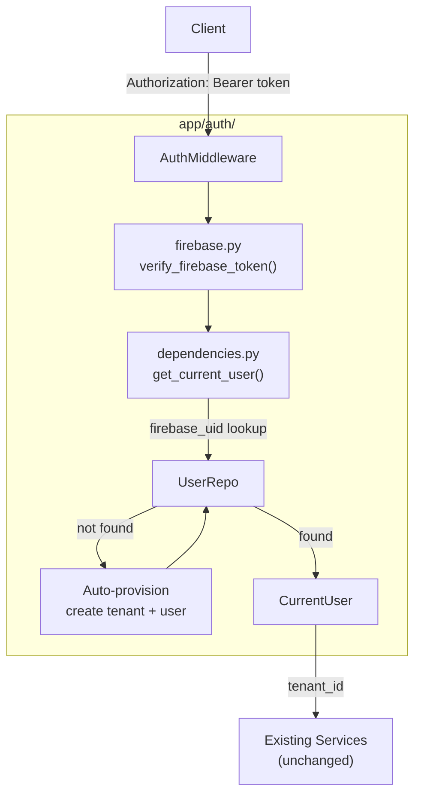

# Firebase Authentication – Phase 2

## What Changes, What Stays the Same

**Unchanged:** all repositories, services, retrieval pipeline, planner pipeline, LLM layer, embedding worker, extraction worker, existing migrations.

**Changed (minimally):**

- `app/models/user.py` — add 3 columns
- `app/repositories/user_repository.py` — add `get_by_firebase_uid` + `create_with_firebase`
- `app/schemas/message.py` + `app/schemas/query.py` — remove `tenant_id` / `user_id` from request bodies (now sourced from auth)
- `app/api/messages.py` + `app/api/query.py` — replace body fields with `current_user` dependency
- `app/api/dependencies.py` — add `get_current_user`
- `app/main.py` — initialize Firebase in lifespanx
- `requirements.txt` — add `firebase-admin`

**New:**

- `app/auth/` package (4 files)
- `alembic/versions/0003_firebase_auth.py`

---

## Architecture Flow




---

## New Package: `app/auth/`

### `app/auth/__init__.py`

Empty.

### `app/auth/schemas.py`

```python
class FirebaseClaims(BaseModel):
    uid: str
    email: str | None
    name: str | None
    picture: str | None

class CurrentUser(BaseModel):
    id: UUID
    tenant_id: UUID
    firebase_uid: str
    email: str | None
    display_name: str | None
```

### `app/auth/firebase.py`

- Singleton `_firebase_app`: initialized once via `initialize_firebase_app()` called from `main.py` lifespan.
- Reads credentials from env var `FIREBASE_CREDENTIALS_JSON` (JSON string) or `FIREBASE_CREDENTIALS_PATH` (file path).
- `verify_firebase_token(token: str) -> FirebaseClaims`: calls `firebase_admin.auth.verify_id_token(token)`, extracts `uid/email/name/picture`, raises `HTTPException(401)` on any failure. Never logs the token.

### `app/auth/middleware.py`

- `extract_bearer_token(authorization: str | None) -> str`: reads the `Authorization` header, validates `Bearer`  prefix, raises `HTTPException(401, "Missing or invalid Authorization header")` if malformed.
- Kept as a pure utility function — no FastAPI `Request` dependency, easily testable.

### `app/auth/dependencies.py`

```python
async def get_current_user(
    authorization: str | None = Header(None),
    session: AsyncSession = Depends(get_db),
) -> CurrentUser:
    token = extract_bearer_token(authorization)
    claims = verify_firebase_token(token)

    user_repo = UserRepository(session)
    tenant_repo = TenantRepository(session)

    user = await user_repo.get_by_firebase_uid(claims.uid)

    if user is None:
        # Auto-provision: one tenant per new user
        tenant = await tenant_repo.create(name=claims.email or claims.uid)
        user = await user_repo.create_with_firebase(
            tenant_id=tenant.id,
            name=claims.name or claims.email or claims.uid,
            firebase_uid=claims.uid,
            email=claims.email,
            display_name=claims.name,
        )
        logger.info("provisioned_new_user", extra={"uid": claims.uid, "user_id": str(user.id), "tenant_id": str(user.tenant_id)})

    logger.info("authenticated", extra={"uid": claims.uid, "user_id": str(user.id), "tenant_id": str(user.tenant_id)})
    return CurrentUser(
        id=user.id,
        tenant_id=user.tenant_id,
        firebase_uid=user.firebase_uid,
        email=user.email,
        display_name=user.display_name,
    )
```

---

## User Model Extension

`[app/models/user.py](app/models/user.py)` — add 3 new nullable columns:

```python
firebase_uid: Mapped[str | None] = mapped_column(String, unique=True, nullable=True, index=True)
email: Mapped[str | None] = mapped_column(String, nullable=True)
display_name: Mapped[str | None] = mapped_column(String, nullable=True)
```

`firebase_uid` has a unique index — one Firebase account maps to exactly one backend user.

---

## Repository Extension

`[app/repositories/user_repository.py](app/repositories/user_repository.py)` — add two methods (no changes to existing methods):

```python
async def get_by_firebase_uid(self, firebase_uid: str) -> User | None:
    # SELECT * FROM users WHERE firebase_uid = :uid
    # NOTE: no tenant_id filter — lookup is by global unique firebase_uid

async def create_with_firebase(
    self, tenant_id, name, firebase_uid, email, display_name
) -> User:
    # INSERT with all new fields
```

`get_by_firebase_uid` is the only repo method that does NOT filter by `tenant_id` — it is a cross-tenant identity lookup by a globally unique key. This is intentional and safe.

---

## Alembic Migration: `0003_firebase_auth.py`

```
down_revision = "0002"

def upgrade():
    op.add_column("users", Column("firebase_uid", String, nullable=True))
    op.add_column("users", Column("email", String, nullable=True))
    op.add_column("users", Column("display_name", String, nullable=True))
    op.create_unique_constraint("uq_users_firebase_uid", "users", ["firebase_uid"])
    op.create_index("ix_users_firebase_uid", "users", ["firebase_uid"])
```

---

## Schema Changes

`[app/schemas/message.py](app/schemas/message.py)` — `MessageCreate` drops `tenant_id` and `user_id` (now from auth):

```python
class MessageCreate(BaseModel):
    content: str
    event_time: datetime | None = None
```

`[app/schemas/query.py](app/schemas/query.py)` — `QueryRequest` drops `tenant_id`:

```python
class QueryRequest(BaseModel):
    question: str
```

---

## API Changes

`[app/api/messages.py](app/api/messages.py)`:

```python
@router.post("/", response_model=MessageResponse, status_code=201)
async def create_message(
    body: MessageCreate,
    background_tasks: BackgroundTasks,
    current_user: CurrentUser = Depends(get_current_user),
    message_service: MessageService = Depends(get_message_service),
    embedding_worker = Depends(get_embedding_worker),
    extraction_worker = Depends(get_extraction_worker),
):
    message = await message_service.create_message(
        current_user.tenant_id, current_user.id, body.content, event_time=body.event_time
    )
    ...
```

`[app/api/query.py](app/api/query.py)`:

```python
@router.post("/", response_model=QueryResponse)
async def query_updates(
    body: QueryRequest,
    current_user: CurrentUser = Depends(get_current_user),
    service: QueryService = Depends(get_query_service),
):
    return await service.answer(current_user.tenant_id, body.question)
```

`POST /tenants` and `POST /users` remain unchanged — they are internal provisioning endpoints, not client-facing after auth is in place.

---

## `app/main.py` Change

Add `initialize_firebase_app()` call in the lifespan, before `init_db()`:

```python
from app.auth.firebase import initialize_firebase_app

@asynccontextmanager
async def lifespan(app):
    logging.basicConfig(...)
    initialize_firebase_app()   # ← new
    await init_db()
    yield
```

---

## `requirements.txt` Change

Add:

```
firebase-admin>=6.5.0
```

---

## Environment Variables

Add to `.env.example`:

```
FIREBASE_CREDENTIALS_JSON={"type":"service_account",...}
# OR
FIREBASE_CREDENTIALS_PATH=/path/to/serviceAccountKey.json
```

Add `FIREBASE_CREDENTIALS_JSON: str | None` and `FIREBASE_CREDENTIALS_PATH: str | None` to `app/config.py`.

---

## What the Frontend Sends After This Change


| Endpoint         | Before                          | After                                          |
| ---------------- | ------------------------------- | ---------------------------------------------- |
| `POST /messages` | `{tenant_id, user_id, content}` | `{content}` + `Authorization: Bearer <token>`  |
| `POST /query`    | `{tenant_id, question}`         | `{question}` + `Authorization: Bearer <token>` |


---

## File Summary


| File                                     | Action                        |
| ---------------------------------------- | ----------------------------- |
| `app/auth/__init__.py`                   | New (empty)                   |
| `app/auth/schemas.py`                    | New                           |
| `app/auth/firebase.py`                   | New                           |
| `app/auth/middleware.py`                 | New                           |
| `app/auth/dependencies.py`               | New                           |
| `app/models/user.py`                     | Add 3 columns                 |
| `app/repositories/user_repository.py`    | Add 2 methods                 |
| `app/schemas/message.py`                 | Remove tenant_id + user_id    |
| `app/schemas/query.py`                   | Remove tenant_id              |
| `app/api/messages.py`                    | Add `current_user` dep        |
| `app/api/query.py`                       | Add `current_user` dep        |
| `app/api/dependencies.py`                | No change                     |
| `app/main.py`                            | Add Firebase init to lifespan |
| `app/config.py`                          | Add Firebase env vars         |
| `requirements.txt`                       | Add firebase-admin            |
| `alembic/versions/0003_firebase_auth.py` | New migration                 |
| `.env.example`                           | Add Firebase vars             |


