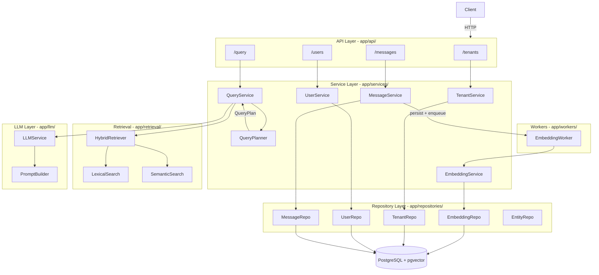
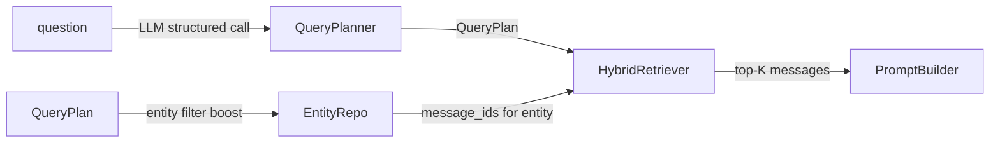
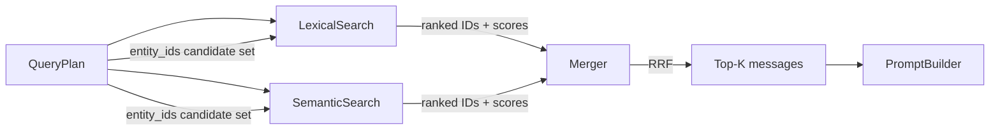

# Limitless Backend – Phase 1

## Architecture Overview



## File Structure

```
limitless/
├── app/
│   ├── api/
│   │   ├── __init__.py
│   │   ├── dependencies.py        # DB session, tenant validation DI
│   │   ├── tenants.py
│   │   ├── users.py
│   │   ├── messages.py
│   │   └── query.py
│   ├── services/
│   │   ├── tenant_service.py
│   │   ├── user_service.py
│   │   ├── message_service.py
│   │   ├── query_service.py
│   │   └── embedding_service.py
│   ├── repositories/
│   │   ├── base.py
│   │   ├── tenant_repository.py
│   │   ├── user_repository.py
│   │   ├── message_repository.py
│   │   ├── embedding_repository.py
│   │   └── entity_repository.py
│   ├── models/
│   │   ├── base.py                # SQLAlchemy declarative base
│   │   ├── tenant.py
│   │   ├── user.py
│   │   ├── message.py
│   │   ├── message_embedding.py
│   │   └── entity.py
│   ├── schemas/
│   │   ├── tenant.py
│   │   ├── user.py
│   │   ├── message.py
│   │   ├── query.py
│   │   └── query_plan.py          # QueryPlan structured intent schema
│   ├── llm/
│   │   ├── base.py                # Abstract LLMProvider interface
│   │   ├── openai_provider.py     # OpenAI implementation
│   │   └── prompt_builder.py      # Rich context formatting + conflict-resolution instruction
│   ├── retrieval/
│   │   ├── base.py                # Abstract Retriever interface
│   │   ├── hybrid_retriever.py    # Merges lexical + semantic; entity-boosted when QueryPlan has entity
│   │   ├── lexical.py             # Inline to_tsvector() full-text (no generated column)
│   │   └── semantic.py            # pgvector cosine similarity
│   ├── query_planner/
│   │   ├── __init__.py
│   │   ├── base.py                # Abstract QueryPlannerBase interface
│   │   ├── openai_planner.py      # LLM-backed structured intent extractor
│   │   └── schemas.py             # QueryPlan dataclass / Pydantic model
│   ├── db/
│   │   ├── session.py             # Async engine + session factory
│   │   └── init_db.py             # create_all + seed
│   ├── workers/
│   │   └── embedding_worker.py    # BackgroundTasks wrapper; swap-for-Celery interface
│   ├── config.py                  # Pydantic BaseSettings from .env
│   └── main.py                    # FastAPI app, lifespan, router registration
├── alembic/
│   ├── env.py
│   └── versions/
│       └── 0001_initial.py
├── alembic.ini
├── seed.py                        # Standalone seed script
├── .env.example
├── requirements.txt
├── docker-compose.yml             # postgres + pgvector
└── README.md
```

## Key Design Decisions

### Database Schema

- All tables carry `tenant_id` (FK to `tenants.id`); every repo query hard-scopes by it
- `messages` is append-only; no UPDATE/DELETE routes or repo methods
- `message_embeddings` stores the pgvector `vector(1536)` column separately; uses `pgvector` extension
- Full-text search uses **inline** `to_tsvector('english', content)` in the query — no generated column, simpler migrations
- New `entities` table stores extracted named entities per message

**entities table:**
```
id           UUID PK
tenant_id    UUID FK → tenants.id
message_id   UUID FK → messages.id
entity_type  TEXT  (e.g. PERSON, ORDER, MACHINE)
entity_value TEXT  (e.g. "Rajan", "4521", "Line 2")
created_at   TIMESTAMPTZ
```

Example rows:

| entity_type | entity_value |
|-------------|--------------|
| PERSON      | Rajan        |
| ORDER       | 4521         |
| MACHINE     | Line 2       |

Seed data will include pre-populated entities. Async extraction from the LLM can be added in Phase 2 without schema changes.

---

### QueryPlan — Structured Intent Before Retrieval

Before retrieval runs, the question is parsed into a structured `QueryPlan` by a dedicated `QueryPlanner` service.

```python
class QueryPlan(BaseModel):
    intent: str          # e.g. "pending_status", "status_update", "person_activity"
    entity: str | None   # e.g. "Rajan", "4521" — matched against entities table
    time_range: str | None  # e.g. "this_week", "today", "last_month"
```

Flow:



- `QueryPlannerBase(ABC)` with `async def plan(question: str) -> QueryPlan`
- `OpenAIPlanner` calls the LLM with `response_format={"type": "json_object"}` and a strict system prompt
- When `QueryPlan.entity` is set, retrieval pre-filters `message_ids` from the `entities` table, then passes them as a candidate set to both the lexical and semantic searches — this dramatically improves precision for entity-specific questions
- When `QueryPlan.time_range` is set, a date range filter is applied in the repository query
- The `QueryPlan` is included in the structured query log for observability

---

### Rich Retrieval Context + Conflict Resolution in Prompt

`PromptBuilder` formats retrieved messages as structured blocks rather than raw text:

```
[Message ID: 18]
User: Alice
Time: 2026-06-26 09:00 UTC
Content:
Order #4521 delayed due to transport.

[Message ID: 24]
User: Bob
Time: 2026-06-26 11:00 UTC
Content:
Order #4521 shipped.
```

The system prompt explicitly instructs the LLM:

> "If messages contain conflicting information about the same subject, explain the conflict clearly and prefer the most recent evidence — but do not ignore earlier events. Cite the Message IDs you rely on."

This produces significantly better answers when a topic evolves over time (e.g. a delayed order that later shipped).

---

### Embedding Pipeline

- `POST /messages` persists immediately, then calls `BackgroundTasks.add_task(embedding_worker.enqueue, message_id)`
- `EmbeddingWorker` is a thin interface:

```python
class EmbeddingWorkerBase(ABC):
    async def enqueue(self, message_id: UUID) -> None: ...
```

- The in-process implementation calls `EmbeddingService` directly; future versions can push to Celery/SQS

### Hybrid Retrieval (app/retrieval/)



- Lexical: `ts_rank(to_tsvector('english', content), plainto_tsquery(...))` — **no generated column**, filtered by `tenant_id`
- Semantic: `<=>` cosine distance on `message_embeddings.embedding`, filtered by `tenant_id`
- When `QueryPlan.entity` is present, both searches receive a candidate `message_id` set pre-filtered from the `entities` table — boosting precision significantly
- Merging: Reciprocal Rank Fusion (RRF) — simple, parameter-free, extensible for future reranking step
- Returns top-N `RetrievedMessage` objects (configurable via `settings.retrieval_top_k`)

### LLM Layer

- `LLMProviderBase(ABC)` with a single `async def complete(messages: list[dict]) -> str`
- `OpenAIProvider` is the default implementation; swappable via config
- `PromptBuilder` constructs the grounded system prompt + user turn with **rich block formatting** and explicit conflict-resolution instruction (see above)

### Query Logging

- `QueryService` records a structured log entry (Python `logging` with JSON formatter) containing: `tenant_id`, `question`, `query_plan` (full intent/entity/time_range), `retrieved_message_ids`, `n_retrieved`, `model`, `latency_ms`
- Structured as a `QueryLog` dataclass so it can be persisted to a `query_logs` table in a future phase without changing the call sites

### Configuration (`app/config.py`)

Using `pydantic_settings.BaseSettings`:

```python
DATABASE_URL: str          # asyncpg DSN
OPENAI_API_KEY: str
OPENAI_MODEL: str = "gpt-4o-mini"
EMBEDDING_MODEL: str = "text-embedding-3-small"
RETRIEVAL_TOP_K: int = 10
LOG_LEVEL: str = "INFO"
```

### Multi-tenancy Enforcement

- Every repository method takes `tenant_id: UUID` as a required parameter
- `GET`/`POST` handlers resolve `tenant_id` from the request body or path; a `get_verified_tenant` dependency validates existence
- No cross-tenant leakage is possible because the SQL `WHERE tenant_id = :tid` clause is emitted by the repository, not the caller

## Implementation Order

1. Project scaffold: `requirements.txt`, `docker-compose.yml`, `.env.example`, `alembic.ini`
2. Config + DB session (`app/config.py`, `app/db/session.py`)
3. SQLAlchemy models (tenant, user, message, message_embedding, **entity**) + Alembic migration
4. Pydantic schemas including `QueryPlan`
5. Repositories (base + all five, all tenant-scoped)
6. Services (tenant, user, message)
7. API routes (tenants, users, messages) + DI dependencies
8. Embedding worker + embedding service
9. **QueryPlanner** (`app/query_planner/`: base + OpenAI implementation)
10. LLM layer (base, OpenAI provider, **rich** prompt builder with conflict-resolution instruction)
11. Retrieval layer (lexical with inline `to_tsvector`, semantic, hybrid with entity-boost)
12. Query service (QueryPlan → entity-boosted retrieval → LLM) + `/query` route
13. Seed data (`seed.py` with entities pre-populated)
14. Structured query logging (includes `query_plan` field)
15. README + `.env.example`